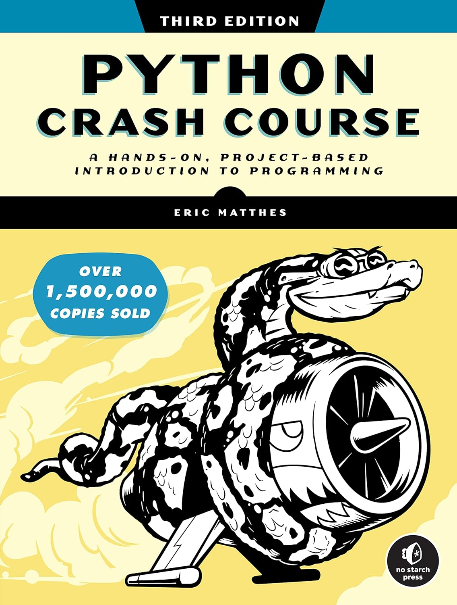

# Exercise for Python Crash Course - 3rd Edition by Eric Matthes

## Contents

1. [Cover page image of the book](cover-pcc-3d-edition.jpg)

2. [Hand-written notes as PDF](python-crash-course-notes.pdf)

3. All chapter exercises

4. Project 1 - Alien Games to learn OOP concepts and implementation

5. Project 2 - Data Visualization to learn essentials for Data Sciense

6. Project 3 - Djano based web application

